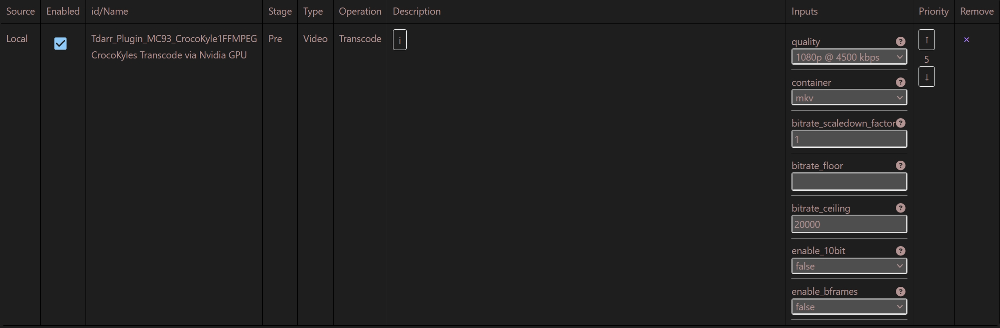
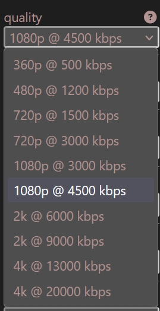

# CrocoKyles Transcode via Nvidia GPU

### Description
Files not in HEVC will be transcoded to HEVC using an Nvidia GPU through ffmpeg.
All files not in the target quality profile will either be upscaled or downscaled to fit this resolution.
The output bitrate will target an appropriate bitrate for the chosen quality profile, however, the bitrate
settings provided will override this behavior.

This is a rewrite of Migz Transcode Using Nvidia GPU & FFMPEG.

### Config Menu

### Quality Profile Presets
